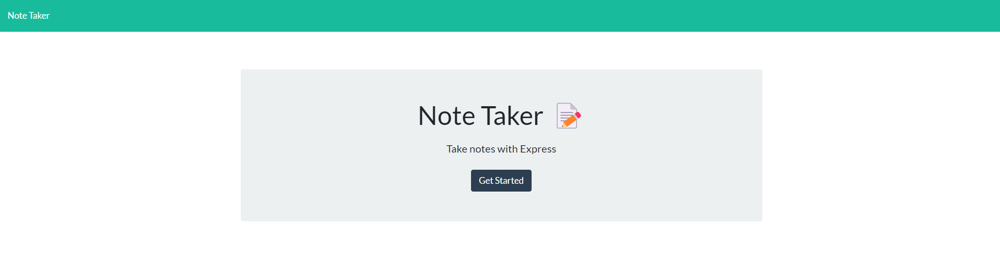
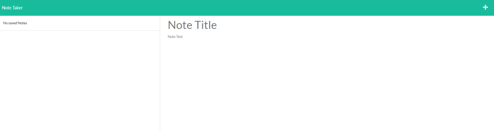
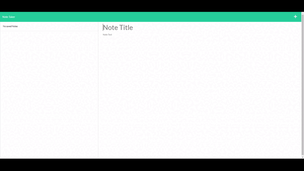

<h1 align="center">Note Taker 📖✍️</h1>
📙📕📗📘📙📕📗📘📙📕📗📘📙📕📗📘📙📕📗📘📙📕📗📘

---

# Description

This app allow you to keep a list of notes for you. It will save all the notes you have entered in a database in the server. The data is presistent, meaning that the notes will remain saved in the server

# Table of Contents

[Installation](#installation)

[Usage](#usage)

[Technologies](#technologies)

[Contribution](#contribution)

[Tests](#test)

[Questions](#questions)

[License](#license)

# Installation
Option 1 

[run app local]

1. First have Node.js installed
2. clone the repo and in your terminal type `git clone https://github.com/SophoanMeas/note-taker.git`
3. type `npm i` in the terminal to install all the node dependencies for this project
4. type `npm run dev` to run start the server in the background in your terminal
5. launch your browser and type `localhost:3001` to be routed to the landing page

Option 2

[run app on live server]

1. click on the link below to be redirect to the application
<a href="https://sophoanmeas.github.io/weather-dashboard/develop/index.html" target="_blank"><h2>📔Note Taker</a>

# Usage

- Click on the __Get Started__ Button
- To use the app enter a `Note Title` and a `Message` in the text field.
- Click on the `save` icon on the top right to save the note
- Your note saved note will be display on the left hand side
- To delete a note, click on the `trash bin` icon to remove the note from the list
# Technologies

* HTML
* CSS
* Jquery
* Bootstrap (style)
* JavaScript
* Node.js

libraries: express, util, path, uuid,
# Contribution

N/A

# Test

N/A

# Questions

---

<h1 align="center">Contact Me</h1>

Check out my Github for more projects

Have a question? Feel free to drop me an email.

📧[sophoan.meas@hotmail.com](mailto:sophoan.meas@hotmail.com)

---

# License

#### Copyright© [sophoanMeas](https://github.com/sophoanMeas). All rights reserved.
#### Licensed under *GNU*

---

## Screenshot

## Tutorial Video
- click on the image, will redirect you to the video

